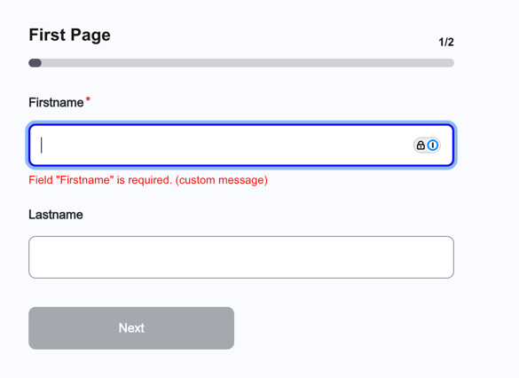

# React Drupal Webform components (Alpha Version)

> This package is currently in **alpha** and under active development.


react-drupal-webform is a lightweight React integration for Drupal Webform.
It allows you to take the Webform structure exported from Drupal (as a Javascript object), load it into a React application, and render the form with full control over its UI.

The library only covers a limited subset of Drupal Webform features and is not a full implementation. Some behaviors and advanced options from Webform are not supported.

Validation for the form is powered by Yup.
You can also extend, override, or inject your own custom validation rules.

# Installation and usage

The easiest way to use react-drupal-webform is to install it from npm and build it into your app with Webpack.

```
yarn add react-drupal-webform
```

Then use it in your app.

### Version Compatibility

Tested and validated with:

````
React :

- React `^15`
- react-hook-form `7.54.2`
- Yup `1.6.1`

Drupal : 

- Webform `6.2.9`
````


## Allowed Webform features from DRUPAL

### Allowed elements '#type'

- textfield
- textarea
- radios
- webform_actions
- checkbox
- checkboxes
- number
- tel
- select
- email
- date
- webform_markup
- managed_file
- hidden
- fieldset
- container
- details
- webform_flexbox
- webform_section
- wizard_page

### Allowed element features

#### General

- **Element settings**
  - Title : ✅
  - Allowed number of values : ❌

- **Element description / help / more**
  - Description : ✅
  - Help
    - Help title : ✅
    - Help text : ✅
  - More
    - More title : ✅
    - More text : ✅

- **Form Display**
  - Title Display / Description Display / Help Display : ❌
  - Field prefix / Field Suffix : ✅
  - Min Length / Max length : ✅
  - Size : ❌
  - Placeholder : ✅
  - Autocomplete : ❌
  - Input Mask : ❌
  - Input hiding : ❌
  - Disabled : ❌
  - Readonly : ❌
  - Prepopulate : ❌

- **Form Validation**
  - Required : ✅
  - Required message : ❌
  - Unique : ❌
  - Pattern : ❌
  - Counter : ❌

#### Conditions

- States : only "Visible". 
- Elements : One / All.
- Trigger : Value is / Value is not.

All others feature are not available.

#### Advanced

No feature allowed

#### Access 

No feature allowed

#### General (for wizard_page)

- **Elements settings**
  - Title : ✅

- **Page settings**
  - Previous page button label : ✅
  - Next page button label : ✅

- **Form Display**
  - Open : ❌

## Examples

Here is a simple webform created in Drupal : 

Here is the result on the React App:


### Exemple 1 : Required field


### Exemple 2 : Multiple pages


### Differences with the Drupal version

There is some few CSS differences, the react-webform library uses Yup and RHF (React Hook Form), so the error-handling system is not native to HTML5.

### Use of React Hook Component

```js
import React from 'react';
import Webform from 'react-drupal-webform';
import { getWebform } from './api'

export default async function App() {
    const webformElementsSource = await getWebform()

    const handleSubmit = async (formData: Record<any, string>) => {
        console.log(formData)
    }
    
    return (
        <div className="App">
            <Webform
                elementsSource={correctElementsSource}
                onSubmit={handleSubmit}
            />
        </div>
    );
}
```

## Props

Common props you may want to specify include:

- `elementsSource` - the elements from de webform (need to be an Javascript object, so parse the YAML from Drupal before )
- `classNames` - Javascript object to apply classnames to wrappes, states, ect...
- `components` - Javascript object to list all components
- `onSubmit` - An async function that is called after submitting the form.
- `includeInactiveFieldsInSubmit` - Includes conditionally hidden fields in the submission result (except hidden inputs).
- `defaultFieldStateMessages` - Default messages for field errors, required fields, etc.
- `customValidators` - custom yup Validator

### Props - components

`TYPE` - TWebformCustomComponents

- `label` – Renders the label of each field.
- `wrapper` – Container wrapping a field and its label.
- `errorFieldMessage` – Displays validation and error messages for a field.
- `input` – Renders standard input fields (textfield, email, number).
- `managedFile` – Renders a managed file input field.
- `managedFilePreview` – Displays a preview of the uploaded managed file.
- `select` – Renders a select (dropdown) field.
- `checkboxes` – Renders a group of checkbox fields.
- `checkbox` – Renders a single checkbox field.
- `radios` – Renders a group of radio buttons.
- `textarea` – Renders a textarea field.
- `wysiwyg` – Renders for all wysiwyg (for exemple on help / Description / more).
- `help` – Renders the help block associated with a field.
- `description` – Renders the description text of a field.
- `more` – Renders the “more information” block of a field.
- `managedFileInfo` – Displays additional information related to a managed file.
- `multiStepActions` – Renders navigation actions for multi-step forms (next, previous, submit).
- `multiStepStepper` – Renders the stepper indicating progress in a multi-step form.
- `layout` – Layout wrapper used to structure fields and form sections.
- `hidden` – Renders hidden fields.
- `markup` – Renders static markup elements (HTML/text content).
- `fieldById` – Allows overriding the renderer for a specific field using its ID.


Warning :

When building (for exemple) a custom Input component (e.g. a field with an action),
className props are not automatically forwarded. They must be explicitly passed down (or not, if you do not want).
Additionally, to properly integrate user input into the form, the component must be connected to React Hook Form (RHF).

Exemple :


```js
import React from 'react';
import Webform from 'react-drupal-webform';
import { getWebform } from './api'
import CustomInput from './CustomInput'
import CustomFirstNameInput from './CustomFirstNameInput'

export default async function App() {
    const webformElementsSource = await getWebform()

    const handleSubmit = async (formData: Record<any, string>) => {
        console.log(formData)
    }

    const customComponents = {
      input: CustomInput,
      fieldById: {
        firstname: CustomFirstNameInput,
      },
    }
    
    return (
        <Webform 
            elementsSource={correctElementsSource}
            onSubmit={handleSubmit}
            components={customComponents}
        />
    );
}
```

And here the exemple of the CustomInput (using RHF) :
```js
import React, { HTMLInputTypeAttribute } from 'react'
import { TFieldWebformObjCustom } from 'react-drupal-webform/src/lib/types/components/fieldWebformObjCustom'
import { useController, useFormContext } from 'react-hook-form'
import cn from 'classnames'
import styles from './custom.module.scss'

const CustomInput = (props: TFieldWebformObjCustom) => {
  const { fieldKey, field } = props

  const { control } = useFormContext()
  const controller = useController<any>({ name: fieldKey, control })
  const { field: fieldController, fieldState } = controller

  const getFieldType: HTMLInputTypeAttribute = (() => {
    switch (field?.['#type']) {
      case 'textfield':
        return 'text'
      case 'date':
        return 'date'
      case 'number':
        return 'number'
      case 'email':
        return 'email'
      case 'tel':
        return 'tel'
      default:
        return 'text'
    }
  })()

  return (
    <input
      id={fieldKey}
      className={cn(styles.customInputs, { [styles.error]: fieldState?.error })}
      name={fieldController.name}
      minLength={field?.['#minlength']}
      maxLength={field?.['#maxlength']}
      placeholder={field?.['#placeholder']}
      type={getFieldType}
      onChange={(e) => fieldController.onChange(e)}
      value={fieldController.value ?? ''}
      required={field?.['#required']}
    />
  )
}

export default CustomInput
```

### Props - classNames

The classNames are only available for default css class and scss module class. 
It may not work with tailwind, styled components, MUI, ect...

`TYPE` - TWebformClassNames


- `wrappers` – Class names applied to field wrapper containers.
  - `base` – Base wrapper class applied to all fields.
  - `byCategory` – Wrapper classes based on field category.
    - `textInput` – Wrapper class for text-based inputs.
    - `selectionInput` – Wrapper class for selection inputs (select, radios, checkboxes).
    - `booleanInput` – Wrapper class for boolean inputs (checkbox).
  - `byFieldType` – Wrapper classes mapped to specific Drupal field types.

- `general` – Class names for extra field elements.
  - `fieldLabel` – Class applied to field labels.
  - `fieldDescription` – Class applied to field descriptions.
  - `fieldManagedFileInfo` – Class applied to managed file information blocks.
  - `fieldMore` – Class applied to “more information” blocks.
  - `fieldHelp` – Class applied to help blocks.
  - `fieldWysiwyg` – Class applied to WYSIWYG content.

- `states` – Class names reflecting field states.
  - `fieldError` – Class applied to fields in an error state.
  - `fieldErrorMessage` – Class applied to validation error messages.

- `fields` – Class names applied to specific field types.
  - `textInputs` – Class names for text-based inputs.
    - `base` – Base class applied to all text inputs.
    - `types` – Classes mapped to specific input types (`text`, `email`, `number`, `tel`, `textarea`, `textfield`).
  - `checkboxes` – Class names for checkbox groups.
    - `groupWrapper` – Wrapper class for the checkbox group.
    - `itemWrapper` – Wrapper class for a single checkbox item.
    - `input` – Class applied to the checkbox input element.
    - `label` – Class applied to the checkbox label.
  - `checkbox` – Class names for a single checkbox field.
    - `itemWrapper` – Wrapper class for the checkbox item.
    - `input` – Class applied to the checkbox input element.
    - `label` – Class applied to the checkbox label.
  - `radios` – Class names for radio button groups.
    - `groupWrapper` – Wrapper class for the radio group.
    - `itemWrapper` – Wrapper class for a single radio item.
    - `input` – Class applied to the radio input element.
    - `label` – Class applied to the radio label.
  - `select` – Class names for select fields.
    - `select` – Class applied to the select element.
    - `option` – Class applied to select options.
  - `managedFile` – Class names for managed file fields.
    - `input` – Class applied to the file input element.
  - `markup` – Class names for markup-only elements.
    - `base` – Base class applied to markup content.
  - `layout` – Class names for layout components.
    - `wrapper` – Wrapper class for the layout container.
    - `title` – Class applied to the layout title.
    - `inner` – Class applied to the layout inner content.

- `multiStep` – Class names for multi-step form components.
  - `stepperContainer` – Wrapper class for the stepper component.
  - `stepperHeader` – Class applied to the stepper header.
  - `stepperTitle` – Class applied to the stepper title.
  - `stepperCounter` – Class applied to the step counter.
  - `stepperProgressBarContainer` – Wrapper class for the progress bar container.
  - `stepperProgressBar` – Class applied to the progress bar itself.
  - `actionsContainer` – Wrapper class for step navigation actions.
  - `actionsButtons` – Wrapper class for action buttons.
  - `actionsButtonPrev` – Class applied to the “previous” button.
  - `actionsButtonsNext` – Class applied to the “next” button.

Example : 

```js
import React from 'react';
import Webform from 'react-drupal-webform';
import { getWebform } from './api'
import styles from './webform.module.scss'

export default async function App() {
    const webformElementsSource = await getWebform()

    const handleSubmit = async (formData: Record<any, string>) => {
        console.log(formData)
    }
    
    const customClassNames = {
      general: {
        fieldDescription: styles.fieldDescription
      },
      fields: {
        checkboxes: {
          label: styles.labelCheckboxes
        }
      }
    }
    
    return (
        <Webform 
            elementsSource={correctElementsSource}
            onSubmit={handleSubmit}
            classNames={customClassNames}
        />
    );
}
```

### Props - defaultFieldStateMessage 

`TYPE` - TWebformStateMessages

- `general` – Default validation messages applied to all fields.
  - `errorMessage` – Default message displayed when a field fails validation.
  - `requiredMessage` – Default message displayed when a required field is empty.

- `fields` – Field-type–specific validation messages.
  - `requiredMessages` – Custom required messages mapped by Drupal field type.
  - `errorMessages` – Custom validation error messages mapped by Drupal field type.


```js
import React from 'react';
import Webform from 'react-drupal-webform';
import { getWebform } from './api'

export default async function App() {
    const webformElementsSource = await getWebform()

    const handleSubmit = async (formData: Record<any, string>) => {
        console.log(formData)
    }
    
    const defaultFieldsStateMessages = {
      fields: {
        requiredMessages: {
          textfield: 'Field "{fieldName}" is required. (custom message)',
        },
      }
    };
    
    return (
        <Webform 
            elementsSource={correctElementsSource}
            onSubmit={handleSubmit}
            defaultFieldStateMessages={defaultFieldsStateMessages}
        />
    );
}
```

Example :

```js
import React from 'react';
import Webform from 'react-drupal-webform';
import { getWebform } from './api'

export default async function App() {
    const webformElementsSource = await getWebform()

    const handleSubmit = async (formData: Record<any, string>) => {
        console.log(formData)
    }
    
    const defaultFieldsStateMessages = {
      fields: {
        requiredMessages: {
          textfield: 'Field "{fieldName}" is required. (custom message)',
        },
      }
    };
    
    return (
        <Webform 
            elementsSource={correctElementsSource}
            onSubmit={handleSubmit}
            defaultFieldStateMessages={defaultFieldsStateMessages}
        />
    );
}
```

As you can see, you can also call the "{fieldName}".

Result : 



### Props - includeInactiveFieldsInSubmit 

`TYPE` - boolean

Include fields that inactive (not input hidden !) on the final submit payload.


### Props - customValidators 

`TYPE` - TWebformCustomValidators

This prop is for used custom validators (using yup object).

If the validation schema is rebuilt, don’t forget that for this field we must handle cases such as required validation, for example.

Example : 

```js
import React from 'react';
import Webform from 'react-drupal-webform';
import * as yup from 'yup'
import { getWebform } from './api'

export default async function App() {
    const webformElementsSource = await getWebform()

    const handleSubmit = async (formData: Record<any, string>) => {
        console.log(formData)
    }
    
    const customValidator = {
      byType: {
        textfield: () => 
          yup.string().min(3, 'Any textfield contain at least 3 characters'),
      },
      byId: {
        firstname: () => 
          yup .string().min(3, 'First name must contain at least 3 characters'),
      },
    }
    
    return (
        <Webform 
            elementsSource={correctElementsSource}
            onSubmit={handleSubmit}
            customValidators={customValidator}
        />
    );
}
```
